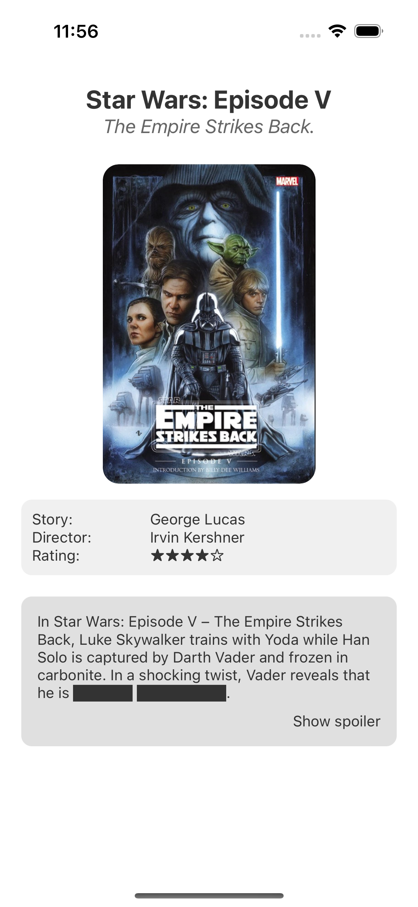

# Les 2

<!--
// TODO: native wind
-->

- [Les 2](#les-2)
  - [React Native](#react-native)
  - [Expo](#expo)
    - [TSX vs JSX](#tsx-vs-jsx)
  - [Opdrachten](#opdrachten)
    - [Opdracht 2.1 - Hello World](#opdracht-21---hello-world)
    - [Opdracht 2.2 - Bezoekersteller](#opdracht-22---bezoekersteller)
    - [Opdracht 2.3 - Wisselende achtergrondkleur](#opdracht-23---wisselende-achtergrondkleur)
    - [Opdracht 2.4 - Random quote generator](#opdracht-24---random-quote-generator)
    - [Opdracht 2.5 - Flexbox](#opdracht-25---flexbox)
    - [Opdracht 2.6 - Dark Mode](#opdracht-26---dark-mode)

  

## React Native

React Native is een framework waarmee je mobiele apps kunt bouwen met JavaScript en React. In plaats van HTML en CSS
worden native UI-componenten gebruikt, waardoor de app eruitziet en aanvoelt als een echte native app.

React Native werkt met een _bridge_, een tussenlaag die zorgt dat JavaScript de native API aan kan spreken. Hierdoor kan
je met JavaScript direct communiceren met de functies van een mobiel besturingssysteem, zoals toegang tot de camera of
GPS.

Doordat er een bridge is voor Android en voor iOS kan je tijdens de ontwikkeling generieke elementen gebruiken. In React
Native heb je bijvoorbeeld het component `<Button>`, dat op Android vertaald wordt naar `android.widget.Button` en op
iOS naar `UIButton`.

  

## Expo

Expo is een ontwikkelomgeving en toolset die het werken met React Native makkelijker maakt.

De Expo Go-app maakt het mogelijk om de app die je aan het ontwikkelen bent eenvoudig op de telefoon te bekijken,
inclusief _live updates_, terwijl `console.log`s op je PC te lezen zijn. Gebruik dit voor debugging.

  

### TSX vs JSX

De officiële documentatie van Expo gebruikt tegenwoordig TypeScript (`.tsx` bestanden), terwijl wij in deze cursus met
JavaScript (`.jsx` bestanden) werken.

TypeScript lijkt erg op JavaScript, maar voegt daaraan typedeclaraties (en controle) toe. Als je documentatie tegenkomt
met TypeScript-code (Bijv. `:string`), kun je deze meestal eenvoudig omzetten naar JavaScript door de type-aanduidingen
weg te laten.

  

## Opdrachten

### Opdracht 2.1 - Hello World

Tijdens deze les zul je meerdere opdrachten uitvoeren. Voor iedere opdracht voer je opnieuw de installatie uit, wat dus
betekent dat je voor iedere opdracht een nieuwe app maakt.

Maak je eerste Expo app door de [installatie van les 2](../guides/installatie.md#les-2) te volgen.

- Test de app op je telefoon
- Verander de standaard tekst naar 'Hello World', of een eigen creatieve tekst.

  

### Opdracht 2.2 - Bezoekersteller

[Installeer](../guides/installatie.md#les-2) een nieuwe Expo app.   Bouw vervolgens een React Native-app waarmee je
het aantal mensen kunt bijhouden dat een ruimte in- en uitloopt (bijvoorbeeld omdat er maar maximaal 200 mensen tegelijk
aanwezig mogen zijn van de brandweer).

**Functionaliteiten**

- De app bevat drie knoppen:
  - **+1** om een persoon toe te voegen.
  - **-1** om een persoon te verwijderen.
  - **Reset** om de teller op 0 te zetten.
- De teller mag nooit kleiner dan **0** worden.
- Als een gebruiker probeert de teller onder **0** te verlagen, toon dan een **alert** met een waarschuwingsbericht.
- Zorg dat de app er **visueel aantrekkelijk** uitziet.

Gebruik `console.log` om de flow van je app te debuggen.

> Klaar? Voeg ook een **progressbar** toe die de capaciteit van 0% tot 100% weergeeft? De progressbar moet dynamisch de
> huidige waarde tonen.

Nuttige links: [View](https://reactnative.dev/docs/view), [Text](https://reactnative.dev/docs/text),
[Button](https://reactnative.dev/docs/button), [useState](https://react.dev/reference/react/useState),
[style](https://reactnative.dev/docs/style), [alert](https://reactnative.dev/docs/alert),
[Progress](https://www.npmjs.com/package/react-native-progress)

  

### Opdracht 2.3 - Wisselende achtergrondkleur

[Installeer](../guides/installatie.md#les-2) een nieuwe Expo app.   Bouw vervolgens een React Native-app met een
enkele **Button** die de achtergrondkleur van het scherm verandert in een \* \*vast patroon\*\*. Zodra de reeks kleuren
is doorlopen, begint deze opnieuw.

**Functionaliteiten**

- Het scherm heeft een **witte achtergrond** bij de start.
- Er is één **Button** die de achtergrondkleur verandert.
- De kleuren veranderen in een **vaste volgorde** en herhalen zich zodra de reeks is doorlopen.
- De **Button zelf verandert ook van kleur** bij elke klik, los van de achtergrondkleur.

  

### Opdracht 2.4 - Random quote generator

[Installeer](../guides/installatie.md#les-2) een nieuwe Expo app.   Bouw vervolgens een React Native-app die bij elke
druk op een knop een lijst met quotes ophaalt en een willekeurige quote toont. Klik
[hier](https://raw.githubusercontent.com/HR-CMGT/PRG07-2024-2025/refs/heads/main/assets/quotes.json) voor de quotes,
klik vervolgens op "Raw" en kopieer dan de URL

**Functionaliteiten**

- De app bevat een `Pressable` knop waarmee je een nieuwe quote kunt laden.
- De quote wordt bijgewerkt zodra de knop wordt ingedrukt.
- Zorg voor een vormgeving, waarbij zowel de knop als de tekst duidelijk en aantrekkelijk worden weergegeven.

Nuttige links: [Pressable](https://reactnative.dev/docs/pressable),
[fetch](https://developer.mozilla.org/en-US/docs/Web/API/Fetch_API)

  

### Opdracht 2.5 - Flexbox

[Installeer](../guides/installatie.md#les-2) een nieuwe Expo app.   Bouw onderstaand ontwerp na. Het gaat daarbij
vooral om de plaatsing van de elementen. Je mag de kleuren aanpassen aan je eigen smaak en je favoriete film of serie
gebruiken.

Bonus: zorg ervoor dat de **Show spoiler** knopt werkt en de spoiler zichtbaar wordt.

Nuttige links: [Flexbox](https://reactnative.dev/docs/flexbox),
[SafeArea](https://docs.expo.dev/versions/latest/sdk/safe-area-context/)

  

### Opdracht 2.6 - Dark Mode

Breid de app van opdracht 2.5 uit met een `Switch` waarmee je kunt wisselen tussen **light mode** en **dark mode**. Zorg
dat de weergave direct verandert wanneer de gebruiker de switch omzet.

In een latere les leer je hoe je deze instelling kunt opslaan op het apparaat, zodat de voorkeur behouden blijft, ook na
het opnieuw opstarten van de app.

Nuttige links: [Switch](https://reactnative.dev/docs/switch)
